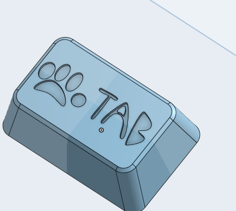
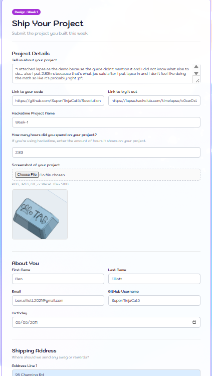
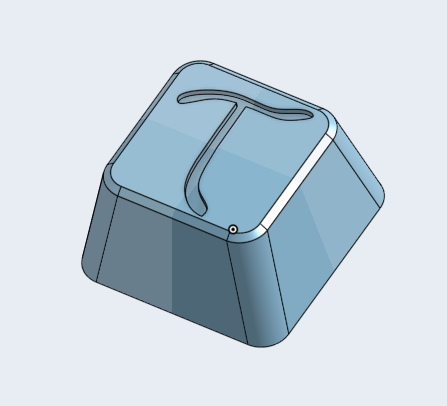
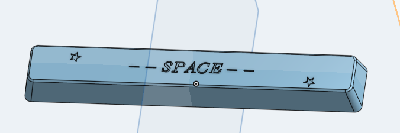
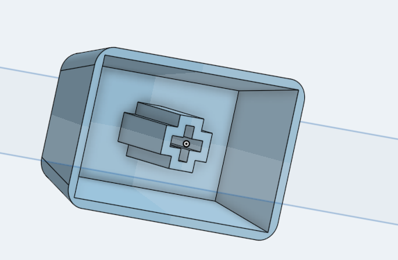

Did design resolution:

I made 3 custom keyscaps: a T key, a tab key, and a space bar!

The T key is the character Tau, which is used in physics to represent torque, and I like physics so that's why I made it.

The Tab key has a cat's paw because tabby cat _airball_ then I had no art skill and did a paw instead of a normal cat.

The space bar is the word space and stars, I wanted to do something different then again released I suck at art.

But yeah that was my first time do cad outside of FRC and I feel like I improved a lot!

\*I attached lapse as the demo because the guide didn't mention it and I did not know what else to do.... also I put 2.83hrs because that's what hackatime said after I put lapse in and I don't feel like doing the math so like it's probably right :pf:

Lapse: https://lapse.hackclub.com/timelapse/c0cwOsURbS5K

### Photos

